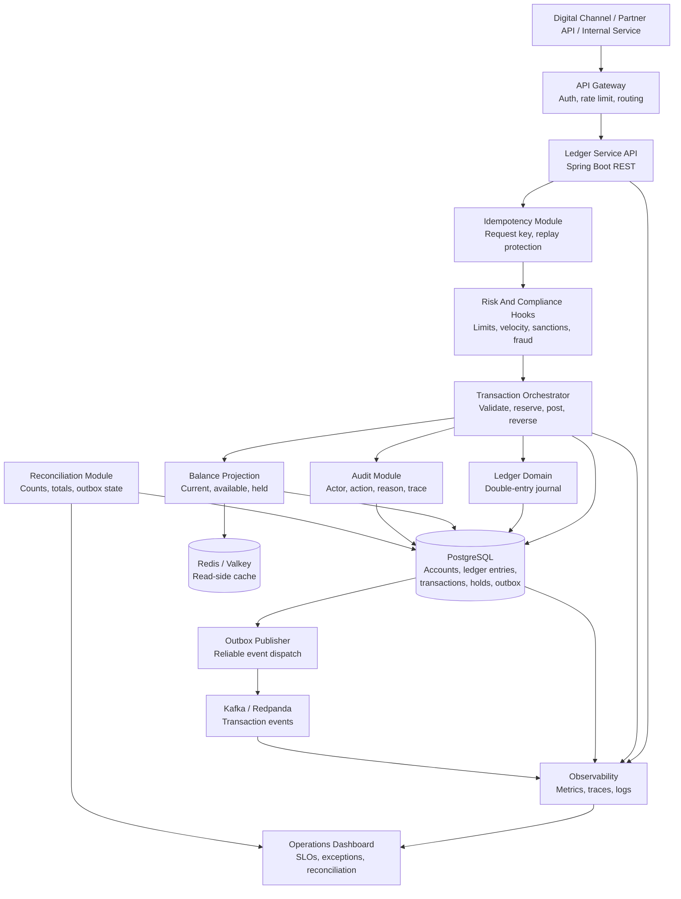

# Core Banking Ledger Architecture

## Flow Summary

1. Client submits a money-movement request with an idempotency key.
2. API gateway authenticates, authorizes, rate-limits, and routes the request.
3. Ledger service checks idempotency before doing any financial work.
4. Risk and compliance hooks validate limits, velocity, and policy rules.
5. Transaction orchestrator creates balanced double-entry ledger records.
6. Database commit stores transaction state, ledger entries, audit events, and outbox event.
7. Outbox publisher sends committed events to Kafka or Redpanda.
8. Reconciliation jobs compare ledger totals, transaction counts, balances, and outbox status.
9. Observability dashboards track latency, failures, database pressure, and financial exceptions.

## Key Reliability Patterns

- Idempotency key for every write command.
- Single database transaction for account state, ledger entries, transaction status, audit event, and outbox row.
- Transactional outbox for event publishing.
- Immutable ledger entries with reversal-based correction.
- Reconciliation jobs for financial totals and operational consistency.
- Explicit exception queue for failed reconciliation or event publication.

