# Oracle Tuning Workflow

```mermaid
flowchart LR
    IMPACT[Business Impact\nSlow API, report, batch, timeout]
    BASELINE[Capture Baseline\nSQL, waits, batch, volume]
    TOPSQL[Identify Top SQL\nElapsed, CPU, buffer gets]
    PLAN[Analyze Plan\nJoins, access paths, cardinality]
    DESIGN[Design Fix\nSQL, index, stats, partition]
    TEST[Test Change\nVolume and regression]
    RELEASE[Controlled Release\nRollback and monitoring]
    MEASURE[Measure Outcome\nBefore vs after]
    GOVERN[Govern\nPrevent regression]

    IMPACT --> BASELINE
    BASELINE --> TOPSQL
    TOPSQL --> PLAN
    PLAN --> DESIGN
    DESIGN --> TEST
    TEST --> RELEASE
    RELEASE --> MEASURE
    MEASURE --> GOVERN
```

## Notes

- Start with business impact so tuning work is tied to value.
- Capture evidence before proposing changes.
- Validate with production-like data before release.
- Compare post-release metrics against the baseline.

