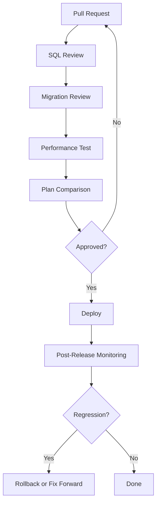

# Performance Governance Flow

## Governance Controls

- Critical SQL reviewed before release.
- Database migrations dry-run in lower environments.
- Execution plan changes reviewed for high-volume queries.
- Post-release monitoring confirms expected improvement.

