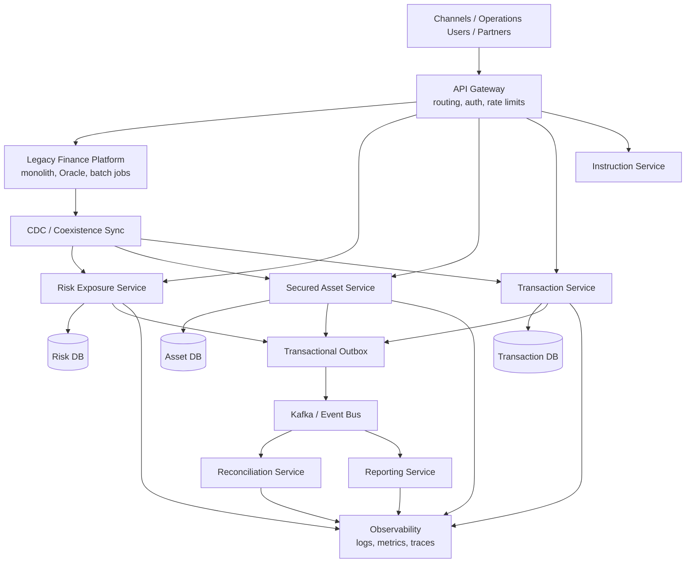

# High-Level Design

## Notes

- Legacy and target systems coexist during migration.
- Service-owned databases replace shared schema coupling.
- Domain events feed reconciliation, reporting, and downstream consumers.
- Observability and reconciliation are part of the migration control plane.
