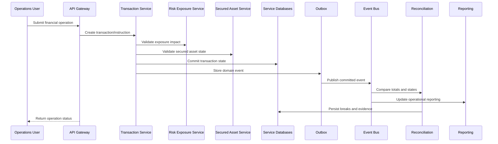

# Low-Level Design

## Key Controls

| Control | Purpose |
| --- | --- |
| Service-owned data | Avoid shared-schema coupling. |
| Transactional outbox | Prevent lost events after database commit. |
| Idempotency | Prevent duplicate operational instructions. |
| Reconciliation | Validate risk, asset, transaction, and reporting state. |
| Audit trail | Preserve actor, decision, timestamp, and correlation ID. |
| Rollback route | Keep legacy fallback during phased migration. |
