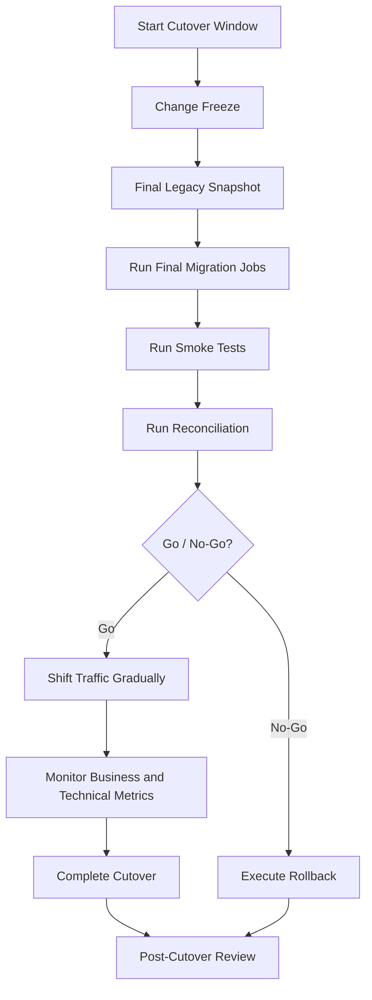

# Cutover Runbook Flow

## Minimum Go Criteria

- Critical reconciliation checks pass.
- Security and audit controls are active.
- Target application health checks pass.
- Rollback path is still valid.
- Support and business owners are available.

