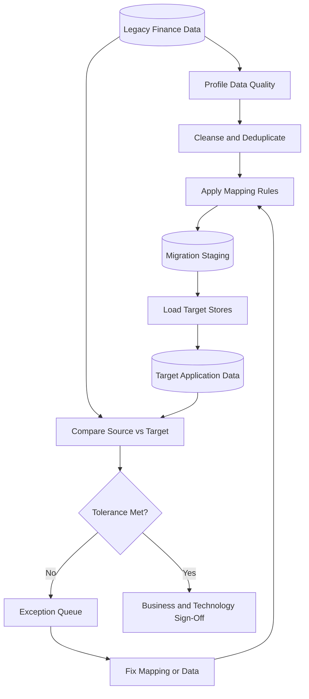

# Data Reconciliation Flow

```mermaid
flowchart TB
    SRC[(Legacy Finance Data)]
    PROFILE[Profile Data Quality]
    CLEANSE[Cleanse and Deduplicate]
    MAP[Apply Mapping Rules]
    STAGE[(Migration Staging)]
    LOAD[Load Target Stores]
    TARGET[(Target Application Data)]
    COMPARE[Compare Source vs Target]
    PASS{Tolerance Met?}
    EXCEPT[Exception Queue]
    FIX[Fix Mapping or Data]
    SIGNOFF[Business and Technology Sign-Off]

    SRC --> PROFILE
    PROFILE --> CLEANSE
    CLEANSE --> MAP
    MAP --> STAGE
    STAGE --> LOAD
    LOAD --> TARGET
    SRC --> COMPARE
    TARGET --> COMPARE
    COMPARE --> PASS
    PASS -- Yes --> SIGNOFF
    PASS -- No --> EXCEPT
    EXCEPT --> FIX
    FIX --> MAP
```

## Validation Dimensions

- Completeness
- Accuracy
- Timeliness
- Referential integrity
- Financial totals
- Lifecycle status
- Auditability

