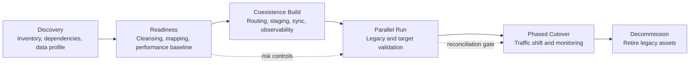

# Migration Roadmap

## Notes

- Use discovery to reduce unknowns before design commitments.
- Use readiness to improve data quality and Oracle performance before migration pressure increases.
- Use coexistence to avoid big-bang replacement.
- Use parallel run and reconciliation as the main cutover gate.

