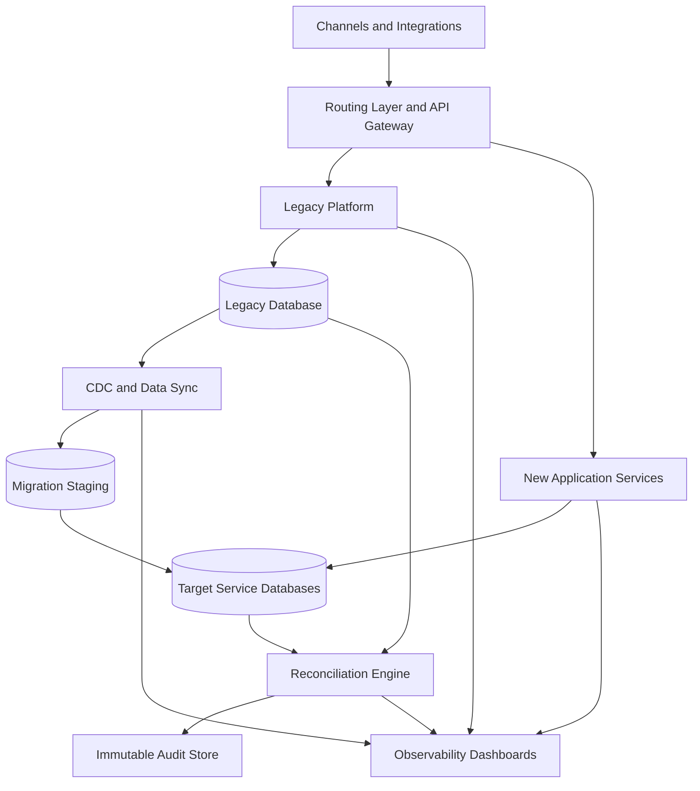
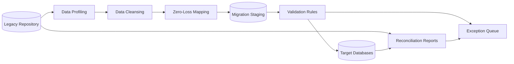
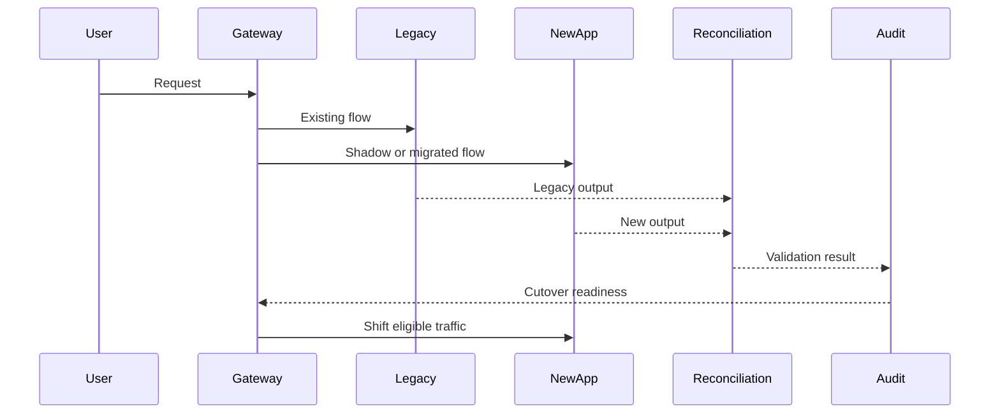

# Migration Architecture

This document defines a general migration architecture for moving a legacy finance system to a modern target application.

The pattern can be used for regulated finance domains such as banking, lending, payments, reporting, risk, operations, or customer servicing.

## High-Level Coexistence Architecture

## Data Migration Flow

## Cutover Sequence

## Architecture Decisions

- Use phased migration instead of big-bang replacement.
- Use API-first routing to decouple channels from legacy database internals.
- Use parallel run for high-risk business flows.
- Use reconciliation reports before production cutover.
- Use immutable audit events for migration evidence.
- Use encryption and least-privilege access for migration jobs.
