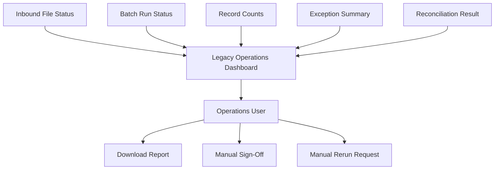

# Batch Operations Dashboard

## Notes

- The dashboard is an operational control surface, not a modern observability system.
- Manual sign-off and rerun decisions create audit and consistency risks.

