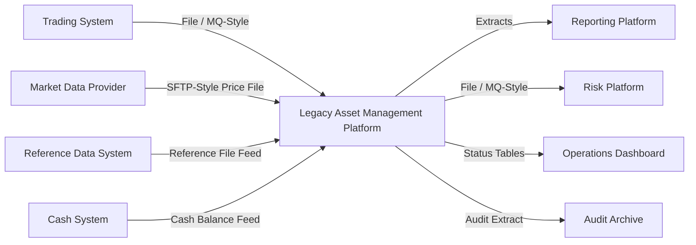

# Integration Landscape

## Notes

- Integration is a mix of file, SOAP/XML-style, MQ-style, and direct reporting patterns.
- Contract ownership is weak compared with modern API/event-driven designs.

