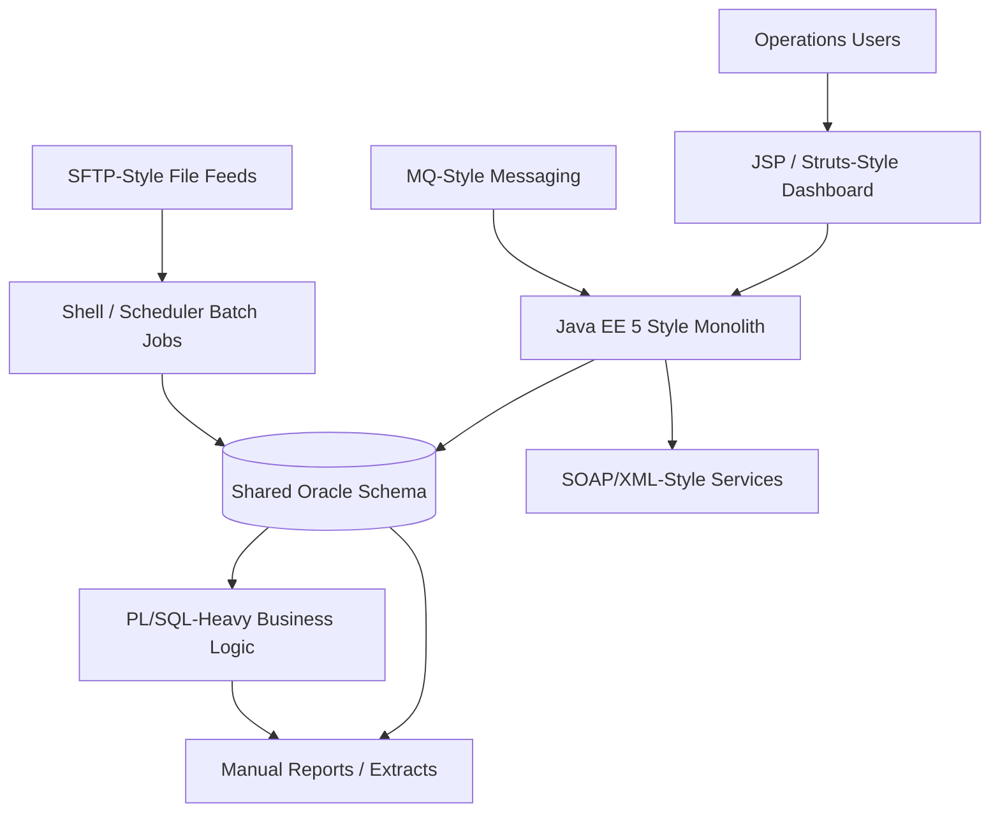

# Legacy Architecture

## Notes

- The monolith, database, batch jobs, and reporting are tightly coupled.
- The shared schema acts as the integration point for several processes.
- Operations visibility is dashboard and report driven rather than observability driven.

