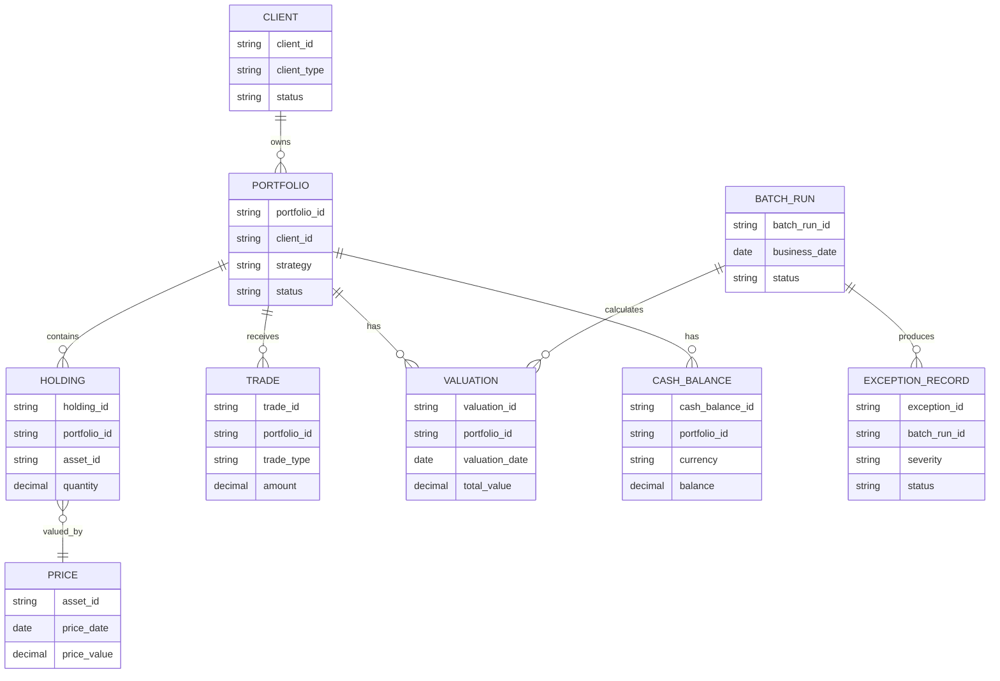

# Legacy Data Model

```mermaid
erDiagram
    CLIENT ||--o{ PORTFOLIO : owns
    PORTFOLIO ||--o{ HOLDING : contains
    PORTFOLIO ||--o{ TRADE : receives
    PORTFOLIO ||--o{ VALUATION : has
    PORTFOLIO ||--o{ CASH_BALANCE : has
    HOLDING }o--|| PRICE : valued_by
    BATCH_RUN ||--o{ EXCEPTION_RECORD : produces
    BATCH_RUN ||--o{ VALUATION : calculates

    CLIENT {
        string client_id
        string client_type
        string status
    }

    PORTFOLIO {
        string portfolio_id
        string client_id
        string strategy
        string status
    }

    HOLDING {
        string holding_id
        string portfolio_id
        string asset_id
        decimal quantity
    }

    TRADE {
        string trade_id
        string portfolio_id
        string trade_type
        decimal amount
    }

    PRICE {
        string asset_id
        date price_date
        decimal price_value
    }

    VALUATION {
        string valuation_id
        string portfolio_id
        date valuation_date
        decimal total_value
    }

    CASH_BALANCE {
        string cash_balance_id
        string portfolio_id
        string currency
        decimal balance
    }

    BATCH_RUN {
        string batch_run_id
        date business_date
        string status
    }

    EXCEPTION_RECORD {
        string exception_id
        string batch_run_id
        string severity
        string status
    }
```

