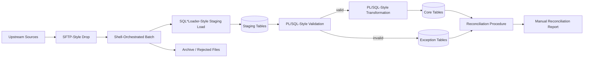

# Legacy Data Pipeline

```mermaid
flowchart LR
    UPSTREAM[Upstream Sources]
    SFTP[SFTP-Style Drop]
    SHELL[Shell-Orchestrated Batch]
    LOAD[SQL*Loader-Style Staging Load]
    STAGE[(Staging Tables)]
    VALIDATE[PL/SQL-Style Validation]
    EXCEPT[(Exception Tables)]
    TRANSFORM[PL/SQL-Style Transformation]
    CORE[(Core Tables)]
    RECON[Reconciliation Procedure]
    REPORT[Manual Reconciliation Report]
    ARCHIVE[Archive / Rejected Files]

    UPSTREAM --> SFTP
    SFTP --> SHELL
    SHELL --> LOAD
    LOAD --> STAGE
    STAGE --> VALIDATE
    VALIDATE -- invalid --> EXCEPT
    VALIDATE -- valid --> TRANSFORM
    TRANSFORM --> CORE
    CORE --> RECON
    EXCEPT --> RECON
    RECON --> REPORT
    SHELL --> ARCHIVE
```

## Notes

- The pipeline is batch-oriented and depends on file arrival.
- Reconciliation is a late-stage control.
- Exceptions require manual operations review.

