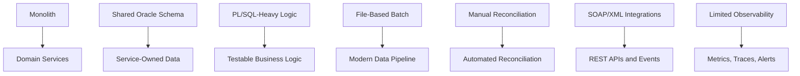

# Migration Pain Points Map

```mermaid
flowchart TB
    MONO[Monolith]
    SHAREDSCHEMA[Shared Oracle Schema]
    PLSQL[PL/SQL-Heavy Logic]
    FILEBATCH[File-Based Batch]
    MANUAL[Manual Reconciliation]
    SOAP[SOAP/XML Integrations]
    OBS[Limited Observability]

    MICROSVC[Domain Services]
    OWNEDDATA[Service-Owned Data]
    TESTABLE[Testable Business Logic]
    PIPELINE[Modern Data Pipeline]
    AUTORECON[Automated Reconciliation]
    APIEVENT[REST APIs and Events]
    DASH[Metrics, Traces, Alerts]

    MONO --> MICROSVC
    SHAREDSCHEMA --> OWNEDDATA
    PLSQL --> TESTABLE
    FILEBATCH --> PIPELINE
    MANUAL --> AUTORECON
    SOAP --> APIEVENT
    OBS --> DASH
```

## Notes

- Each pain point maps to a modernization workstream.
- This diagram can seed the future migration roadmap.

