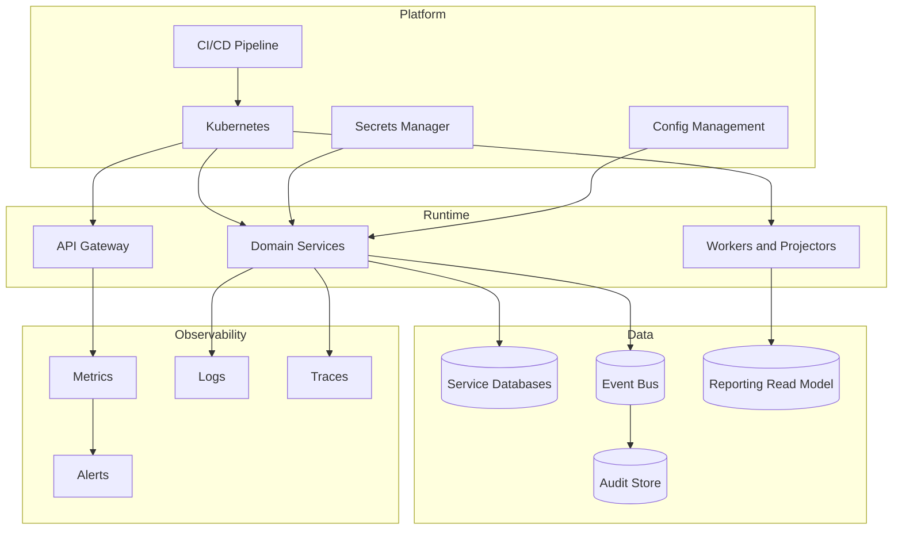

# Deployment View

## Deployment Notes

- Services should be independently deployable.
- Database migrations should run through controlled release pipelines.
- Secrets should not be stored in application repositories.
- Observability should be part of the release definition of done.

