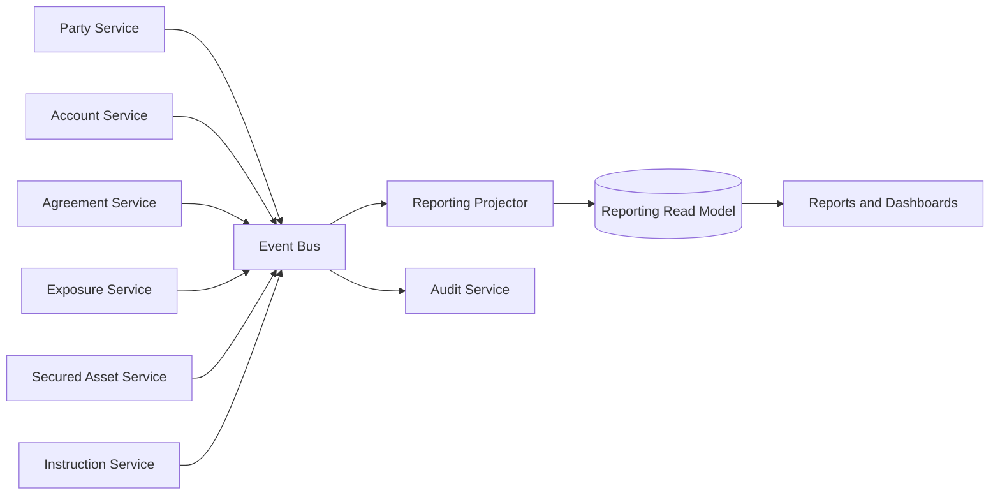

# Event-Driven Reporting

## Reporting Principles

- Do not query operational service databases directly for broad reporting.
- Use events to maintain read models.
- Track projection lag and replay capability.
- Keep audit and reporting concerns separate.

