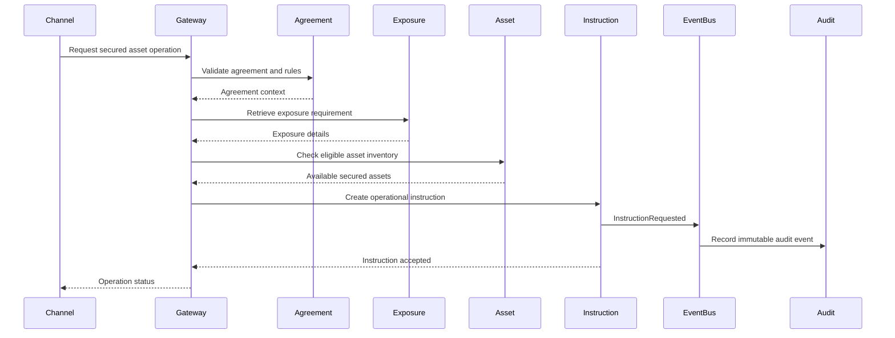

# Service Interaction Flow

## Notes

- Gateway handles routing, authentication integration, throttling, and API versioning.
- Services own business rules inside their boundaries.
- Audit receives events rather than relying on after-the-fact log scraping.

