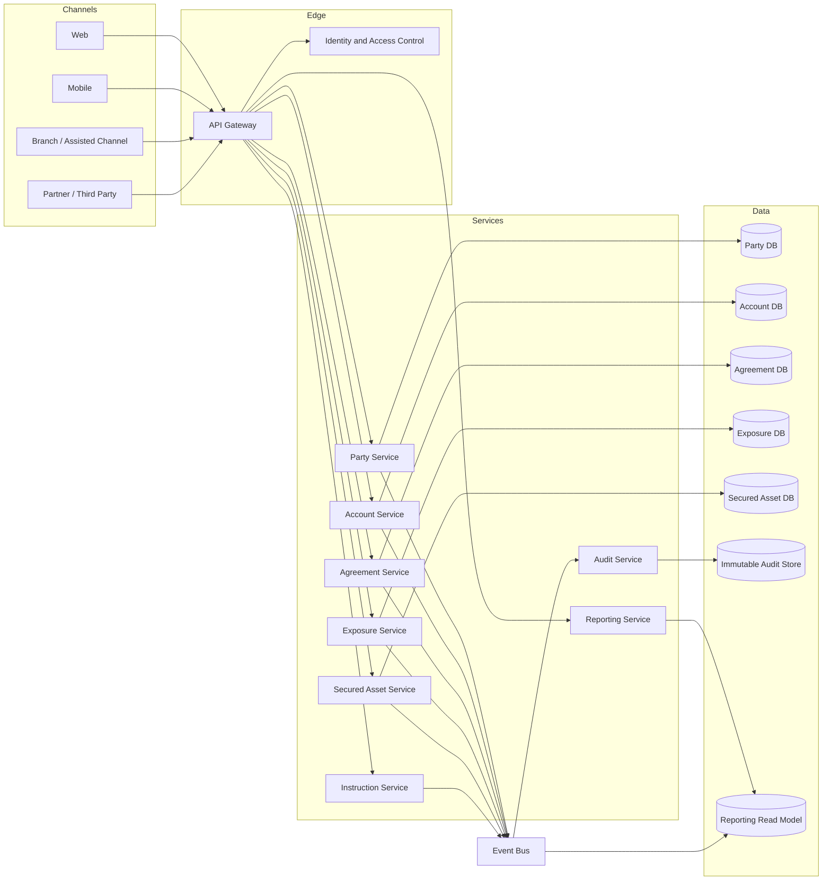

# Risk Exposure & Secured Asset Platform Design

This project defines the target-state design for a modern Risk Exposure & Secured Asset Operations Platform.

## Design Objectives

- Create an API-first platform that supports web, mobile, branch, and partner channels.
- Replace tightly coupled legacy behavior with domain-aligned services.
- Give services clear ownership of their data.
- Support transaction history, account balances, agreements, exposures, secured assets, instructions, and audit trails.
- Enable event-driven reporting and integration.
- Build observability, security, and DevSecOps into the platform from the start.

## Target Architecture

## Domain Services

| Service | Responsibility |
| --- | --- |
| Party Service | Customer, counterparty, legal entity, or participant reference data |
| Account Service | Account profile, account status, and balance context |
| Agreement Service | Agreement rules, eligibility, and lifecycle |
| Exposure Service | Risk exposure, position, valuation, and obligation view |
| Secured Asset Service | Eligible assets, inventory, allocation, and substitution |
| Instruction Service | Operational instructions, workflow status, and settlement-style actions |
| Reporting Service | Read models, operational reports, and channel-safe projections |
| Audit Service | Immutable business and technical audit events |

## Data Modeling

ER diagrams live in [diagrams](diagrams/).

Start with [core-domain-erd.md](diagrams/core-domain-erd.md).

Additional diagrams:

- [service-interaction-flow.md](diagrams/service-interaction-flow.md)
- [event-driven-reporting.md](diagrams/event-driven-reporting.md)
- [deployment-view.md](diagrams/deployment-view.md)

Detailed design docs:

- [service-design.md](docs/service-design.md)
- [data-ownership.md](docs/data-ownership.md)
- [observability-and-devsecops.md](docs/observability-and-devsecops.md)
- [target-technology-strategy.md](docs/target-technology-strategy.md)
- [microservice-database-strategy.md](docs/microservice-database-strategy.md)
- [cloud-architecture-strategy.md](docs/cloud-architecture-strategy.md)
- [ci-cd-and-devsecops-strategy.md](docs/ci-cd-and-devsecops-strategy.md)
- [testing-strategy.md](docs/testing-strategy.md)
- [zero-downtime-strategy.md](docs/zero-downtime-strategy.md)

Technology diagrams:

- [target-cloud-architecture.md](diagrams/target-cloud-architecture.md)
- [ci-cd-pipeline.md](diagrams/ci-cd-pipeline.md)
- [zero-downtime-release-flow.md](diagrams/zero-downtime-release-flow.md)
- [testing-pyramid.md](diagrams/testing-pyramid.md)

## API Design Principles

- Expose business capabilities through REST APIs.
- Keep APIs versioned and contract-tested.
- Avoid direct channel access to service databases.
- Use idempotency keys for write operations.
- Emit domain events for important lifecycle changes.
- Keep audit and trace identifiers across service calls.

## Omnichannel Experience

The target platform should provide consistent data and workflows across:

- Web
- Mobile
- Branch or assisted channels
- Partner and third-party integrations
- Operational dashboards

Channel parity depends on a consistent core data model, clear API contracts, and controlled read models.

## Architecture Decisions

| Decision | Direction |
| --- | --- |
| API access | Channels access business capabilities through APIs, not direct database calls |
| Data ownership | Each service owns its operational data store |
| Integration | Domain events update audit, reporting, and downstream integrations |
| Reporting | Reporting uses read models to avoid loading operational tables |
| Audit | Business lifecycle changes emit immutable audit events |
| Reliability | Critical write APIs use idempotency and traceable request identifiers |
| Cloud | AWS-first target architecture using EKS, Aurora PostgreSQL, MSK, Redis, OpenSearch, S3, and CloudWatch/OpenTelemetry |
| CI/CD | GitHub Actions with quality gates, environment approvals, image scanning, and progressive deployment |
| Testing | Unit, integration, contract, E2E, migration, performance, security, and resilience testing |
