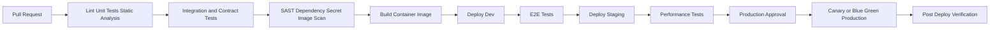

# CI/CD Pipeline

```mermaid
flowchart LR
    PR["Pull Request"]
    QUALITY["Lint Unit Tests Static Analysis"]
    INTEGRATION["Integration and Contract Tests"]
    SECURITY["SAST Dependency Secret Image Scan"]
    BUILD["Build Container Image"]
    DEV["Deploy Dev"]
    E2E["E2E Tests"]
    STAGE["Deploy Staging"]
    PERF["Performance Tests"]
    APPROVAL["Production Approval"]
    PROD["Canary or Blue Green Production"]
    VERIFY["Post Deploy Verification"]

    PR --> QUALITY
    QUALITY --> INTEGRATION
    INTEGRATION --> SECURITY
    SECURITY --> BUILD
    BUILD --> DEV
    DEV --> E2E
    E2E --> STAGE
    STAGE --> PERF
    PERF --> APPROVAL
    APPROVAL --> PROD
    PROD --> VERIFY
```

