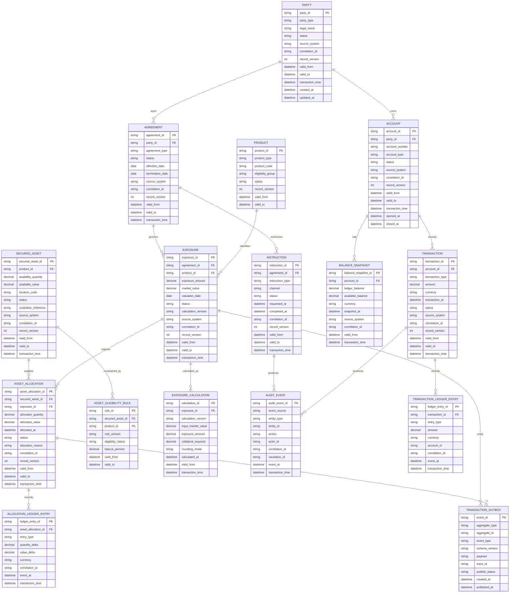

# Core Domain Entity Relationship Diagram

This Entity Relationship Diagram (ERD) models the core entities for a Risk Exposure & Secured Asset Operations Platform. It separates mutable operational records from append-only ledger and audit records, and adds bitemporal fields for financial traceability.

## Ownership Notes

| Entity | Owning Capability | Record Type |
| --- | --- | --- |
| `PARTY` | Party Service | Mutable operational record with bitemporal history fields |
| `ACCOUNT`, `BALANCE_SNAPSHOT`, `TRANSACTION` | Account Service | Operational record and point-in-time snapshots |
| `AGREEMENT` | Agreement Service | Operational agreement lifecycle record |
| `EXPOSURE`, `EXPOSURE_CALCULATION` | Exposure Service | Operational exposure state plus calculation evidence |
| `SECURED_ASSET`, `ASSET_ELIGIBILITY_RULE`, `ASSET_ALLOCATION` | Secured Asset Service | Operational asset inventory, rules, and allocation state |
| `TRANSACTION_LEDGER_ENTRY`, `ALLOCATION_LEDGER_ENTRY` | Ledger/Audit capability | Append-only financial movement evidence |
| `AUDIT_EVENT` | Audit Service | Append-only business and technical audit evidence |
| `TRANSACTION_OUTBOX` | Each writing service | Local transactional event handoff for Change Data Capture (CDC) publishing |

## Bitemporal Field Definitions

| Field | Definition |
| --- | --- |
| `valid_from` | Business-effective start time for the record state |
| `valid_to` | Business-effective end time for the record state |
| `transaction_time` | Time the platform recorded the state change |
| `record_version` | Monotonic version used for optimistic locking, ordering, and reconciliation |
| `correlation_id` | Identifier linking Application Programming Interface (API), event, audit, and reconciliation records for one business action |
