# GitOps Deployment Flow

```mermaid
flowchart LR
    DEV["Developer Pull Request"]
    CI["GitHub Actions CI"]
    TEST["Tests and Security Scans"]
    IMAGE["Build Container Image"]
    ECR["Push to Amazon ECR"]
    MANIFEST["Update Helm Values or GitOps Manifest"]
    APPROVAL["Environment Approval"]
    ARGO["Argo CD Detects Change"]
    EKS["Deploy to Amazon EKS"]
    OBS["Observe Metrics Logs Traces"]
    ROLLBACK["Rollback or Roll Forward"]

    DEV --> CI
    CI --> TEST
    TEST --> IMAGE
    IMAGE --> ECR
    ECR --> MANIFEST
    MANIFEST --> APPROVAL
    APPROVAL --> ARGO
    ARGO --> EKS
    EKS --> OBS
    OBS --> ROLLBACK
```

## Notes

- GitHub Actions owns CI and release preparation.
- Helm packages the Kubernetes application.
- Argo CD owns continuous delivery into EKS.
- Git history becomes the audit trail for desired runtime state.

