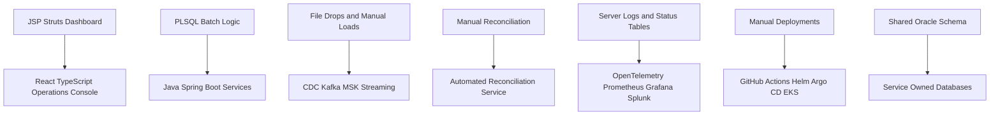

# Legacy To Modern Capability Map

```mermaid
flowchart TB
    JSP["JSP Struts Dashboard"]
    REACT["React TypeScript Operations Console"]
    PLSQL["PLSQL Batch Logic"]
    JAVA["Java Spring Boot Services"]
    FILES["File Drops and Manual Loads"]
    STREAM["CDC Kafka MSK Streaming"]
    MANUAL["Manual Reconciliation"]
    AUTO["Automated Reconciliation Service"]
    LOGS["Server Logs and Status Tables"]
    OBS["OpenTelemetry Prometheus Grafana Splunk"]
    DEPLOY["Manual Deployments"]
    GITOPS["GitHub Actions Helm Argo CD EKS"]
    DB["Shared Oracle Schema"]
    OWNED["Service Owned Databases"]

    JSP --> REACT
    PLSQL --> JAVA
    FILES --> STREAM
    MANUAL --> AUTO
    LOGS --> OBS
    DEPLOY --> GITOPS
    DB --> OWNED
```

