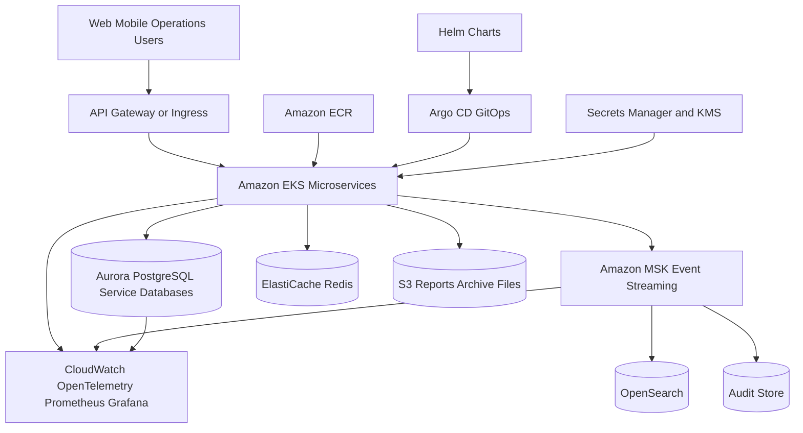

# Target Cloud Architecture

## Notes

- EKS is the recommended portfolio target for Kubernetes-based platform engineering.
- Aurora PostgreSQL is the default relational database for service-owned data.
- MSK supports event-driven integration, audit, reporting, and migration CDC flows.
