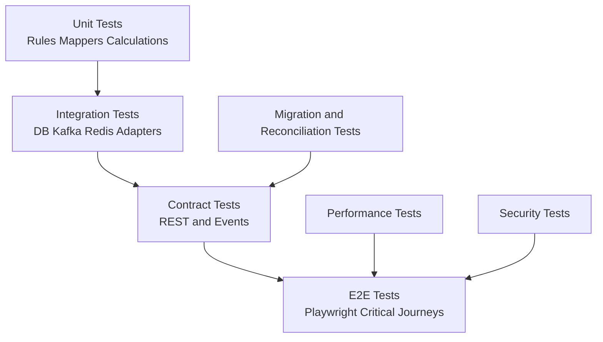

# Testing Pyramid And Quality Gates

```mermaid
flowchart TB
    E2E["E2E Tests\nPlaywright Critical Journeys"]
    CONTRACT["Contract Tests\nREST and Events"]
    INTEGRATION["Integration Tests\nDB Kafka Redis Adapters"]
    UNIT["Unit Tests\nRules Mappers Calculations"]
    MIGRATION["Migration and Reconciliation Tests"]
    PERF["Performance Tests"]
    SECURITY["Security Tests"]

    UNIT --> INTEGRATION
    INTEGRATION --> CONTRACT
    CONTRACT --> E2E
    MIGRATION --> CONTRACT
    PERF --> E2E
    SECURITY --> E2E
```

