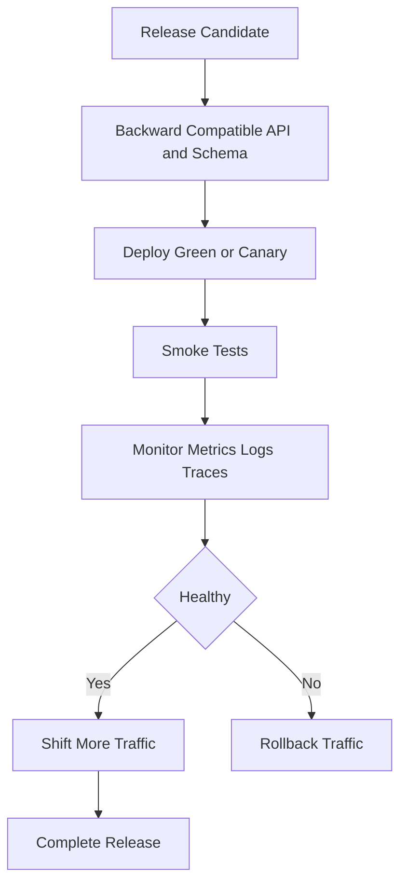

# Zero Downtime Release Flow

```mermaid
flowchart TD
    START["Release Candidate"]
    COMPAT["Backward Compatible API and Schema"]
    DEPLOY["Deploy Green or Canary"]
    SMOKE["Smoke Tests"]
    METRICS["Monitor Metrics Logs Traces"]
    DECIDE{"Healthy"}
    SHIFT["Shift More Traffic"]
    COMPLETE["Complete Release"]
    ROLLBACK["Rollback Traffic"]

    START --> COMPAT
    COMPAT --> DEPLOY
    DEPLOY --> SMOKE
    SMOKE --> METRICS
    METRICS --> DECIDE
    DECIDE -- Yes --> SHIFT
    SHIFT --> COMPLETE
    DECIDE -- No --> ROLLBACK
```

