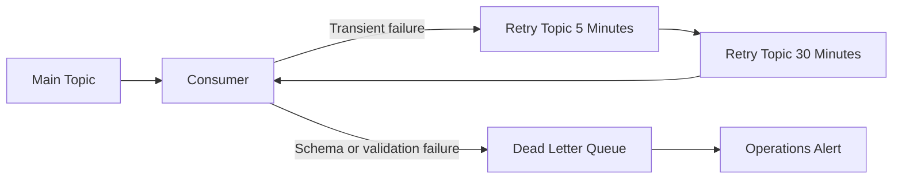

# Kafka Resiliency Policy

This policy defines how event consumers handle poison messages, retries, ordering, and aggregate version safety.

## Non-Blocking Dead Letter Queue Policy

## Deserialization Standard

- Deserialization failures must be caught before business processing.
- Malformed payloads move directly to a Dead Letter Queue (DLQ).
- DLQ records must include raw bytes, topic, partition, offset, schema identifier, event key, trace identifier, and error class.
- Consumer offset is committed only after the DLQ write succeeds.

## Retry Standard

| Failure Type | Action |
| --- | --- |
| Temporary database timeout | Retry with bounded backoff |
| Downstream service unavailable | Retry topic, then circuit breaker |
| Schema incompatibility | Dead Letter Queue (DLQ) immediately |
| Business validation failure | Exception topic or DLQ based on severity |
| Duplicate message | Commit offset after idempotency rejection |

## Message Keying And Ordering

| Event Family | Kafka Key |
| --- | --- |
| Party events | `party_id` |
| Account events | `account_id` |
| Agreement events | `agreement_id` |
| Exposure events | `exposure_id` |
| Secured asset events | `secured_asset_id` |
| Allocation events | `asset_allocation_id` |

Every event must carry `aggregateVersion`. Consumers compare it against the stored version.

| Version Case | Consumer Behavior |
| --- | --- |
| Incoming version equals current version plus 1 | Process event |
| Incoming version equals current version | Treat as duplicate |
| Incoming version lower than current version | Commit offset and record stale event metric |
| Incoming version greater than current version plus 1 | Buffer or quarantine until missing version arrives |

## Metrics

- `kafka_consumer_poison_pill_total`
- `kafka_consumer_retry_total`
- `kafka_consumer_dlq_total`
- `kafka_consumer_duplicate_total`
- `kafka_consumer_out_of_order_total`
- `kafka_consumer_lag_records`

