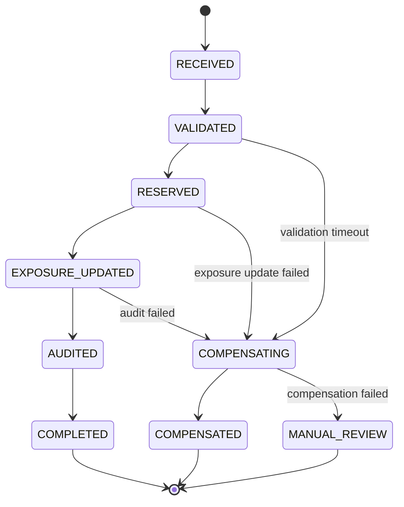

# Saga State Machine And Compensation Rules

This document defines the cross-service transaction model for workflows that cannot be committed in one local database transaction.

## Candidate Workflows

| Workflow | Services | Compensation |
| --- | --- | --- |
| Asset allocation | Instruction, Secured Asset, Exposure, Audit | Release allocation, recalculate exposure, mark instruction failed |
| Asset substitution | Secured Asset, Exposure, Agreement, Audit | Reverse new allocation, restore prior allocation, emit exception |
| Instruction completion | Instruction, Account, Secured Asset, Audit | Reopen instruction, reverse derived status, alert operations |
| Exposure recalculation | Exposure, Market Data, Reporting, Audit | Restore prior approved exposure snapshot and quarantine calculation |

## State Machine

## Timeout Policy

| Step | Timeout | Retry |
| --- | --- | --- |
| Validate instruction | 30 seconds | 3 retries with exponential backoff |
| Reserve secured asset | 60 seconds | 3 retries, then compensate |
| Update exposure | 60 seconds | 3 retries, then compensate |
| Emit audit event | 30 seconds | Retry until outbox accepted |
| Final reconciliation | 15 minutes | Sweeper detects stuck state |

## Saga Record

Each saga record must store:

- Saga identifier
- Workflow type
- Current state
- Business reference
- Correlation identifier
- Last successful step
- Retry count
- Compensation status
- Last error
- Created, updated, and terminal timestamps

## Reconciliation Sweeper

Every 15 minutes, the sweeper scans for sagas that exceed timeout ceilings. It must either move the saga to `COMPLETED`, move it to `COMPENSATED`, or create a `MANUAL_REVIEW` exception with full audit context.

