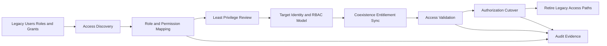

# Auth And RBAC Migration Flow

```mermaid
flowchart LR
    LEGACY["Legacy Users Roles and Grants"]
    DISCOVER["Access Discovery"]
    MAP["Role and Permission Mapping"]
    REVIEW["Least Privilege Review"]
    TARGET["Target Identity and RBAC Model"]
    SYNC["Coexistence Entitlement Sync"]
    VALIDATE["Access Validation"]
    CUTOVER["Authorization Cutover"]
    RETIRE["Retire Legacy Access Paths"]
    AUDIT["Audit Evidence"]

    LEGACY --> DISCOVER
    DISCOVER --> MAP
    MAP --> REVIEW
    REVIEW --> TARGET
    TARGET --> SYNC
    SYNC --> VALIDATE
    VALIDATE --> CUTOVER
    CUTOVER --> RETIRE
    MAP --> AUDIT
    VALIDATE --> AUDIT
    CUTOVER --> AUDIT
```

