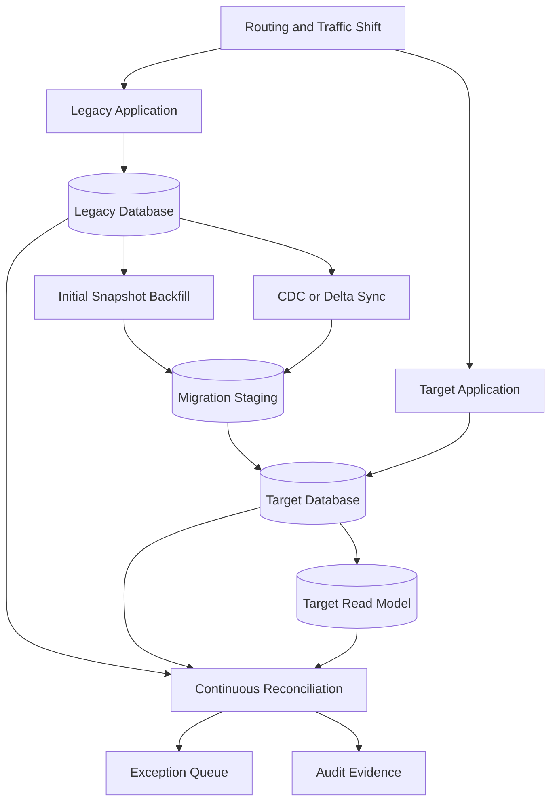

# Coexistence Data Sync Flow

```mermaid
flowchart TB
    LEGACYDB[("Legacy Database")]
    SNAPSHOT["Initial Snapshot Backfill"]
    CDC["CDC or Delta Sync"]
    STAGE[("Migration Staging")]
    TARGETDB[("Target Database")]
    READMODEL[("Target Read Model")]
    RECON["Continuous Reconciliation"]
    EXCEPT["Exception Queue"]
    ROUTER["Routing and Traffic Shift"]
    LEGACYAPP["Legacy Application"]
    TARGETAPP["Target Application"]
    AUDIT["Audit Evidence"]

    LEGACYDB --> SNAPSHOT
    SNAPSHOT --> STAGE
    STAGE --> TARGETDB
    LEGACYDB --> CDC
    CDC --> STAGE
    TARGETDB --> READMODEL
    LEGACYDB --> RECON
    TARGETDB --> RECON
    READMODEL --> RECON
    RECON --> EXCEPT
    RECON --> AUDIT
    ROUTER --> LEGACYAPP
    ROUTER --> TARGETAPP
    LEGACYAPP --> LEGACYDB
    TARGETAPP --> TARGETDB
```

