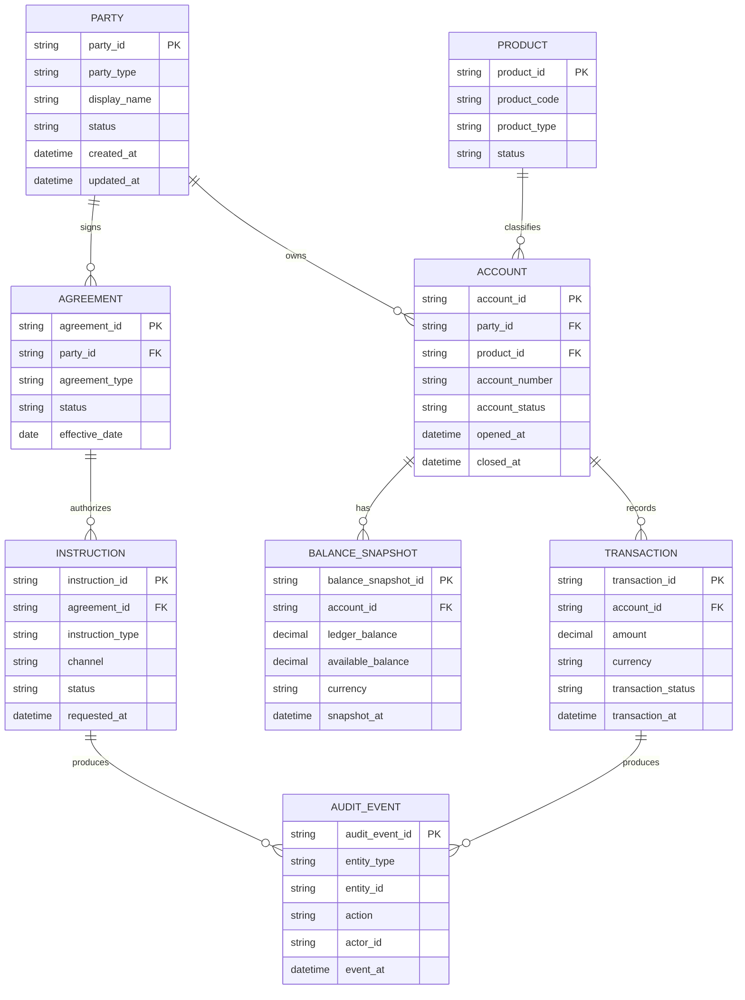

# Logical Finance ERD

```mermaid
erDiagram
    PARTY ||--o{ ACCOUNT : owns
    PARTY ||--o{ AGREEMENT : signs
    ACCOUNT ||--o{ TRANSACTION : records
    ACCOUNT ||--o{ BALANCE_SNAPSHOT : has
    PRODUCT ||--o{ ACCOUNT : classifies
    AGREEMENT ||--o{ INSTRUCTION : authorizes
    INSTRUCTION ||--o{ AUDIT_EVENT : produces
    TRANSACTION ||--o{ AUDIT_EVENT : produces

    PARTY {
        string party_id PK
        string party_type
        string display_name
        string status
        datetime created_at
        datetime updated_at
    }

    ACCOUNT {
        string account_id PK
        string party_id FK
        string product_id FK
        string account_number
        string account_status
        datetime opened_at
        datetime closed_at
    }

    PRODUCT {
        string product_id PK
        string product_code
        string product_type
        string status
    }

    AGREEMENT {
        string agreement_id PK
        string party_id FK
        string agreement_type
        string status
        date effective_date
    }

    TRANSACTION {
        string transaction_id PK
        string account_id FK
        decimal amount
        string currency
        string transaction_status
        datetime transaction_at
    }

    BALANCE_SNAPSHOT {
        string balance_snapshot_id PK
        string account_id FK
        decimal ledger_balance
        decimal available_balance
        string currency
        datetime snapshot_at
    }

    INSTRUCTION {
        string instruction_id PK
        string agreement_id FK
        string instruction_type
        string channel
        string status
        datetime requested_at
    }

    AUDIT_EVENT {
        string audit_event_id PK
        string entity_type
        string entity_id
        string action
        string actor_id
        datetime event_at
    }
```

