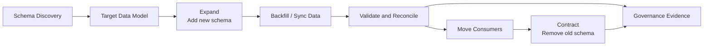

# Schema Evolution Flow

```mermaid
flowchart LR
    DISC[Schema Discovery]
    MODEL[Target Data Model]
    EXPAND[Expand\nAdd new schema]
    BACKFILL[Backfill / Sync Data]
    VALIDATE[Validate and Reconcile]
    SHIFT[Move Consumers]
    CONTRACT[Contract\nRemove old schema]
    GOVERN[Governance Evidence]

    DISC --> MODEL
    MODEL --> EXPAND
    EXPAND --> BACKFILL
    BACKFILL --> VALIDATE
    VALIDATE --> SHIFT
    SHIFT --> CONTRACT
    VALIDATE --> GOVERN
    CONTRACT --> GOVERN
```

## Notes

- Expand before changing consumers.
- Reconcile before removing legacy structures.
- Keep approval and audit evidence for high-risk changes.

